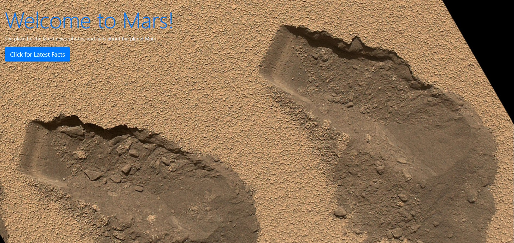
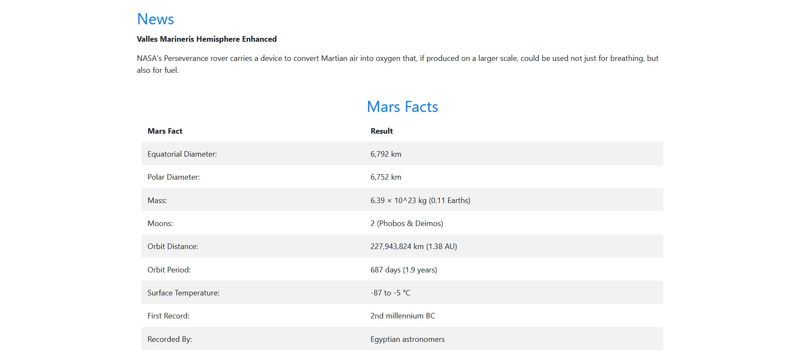
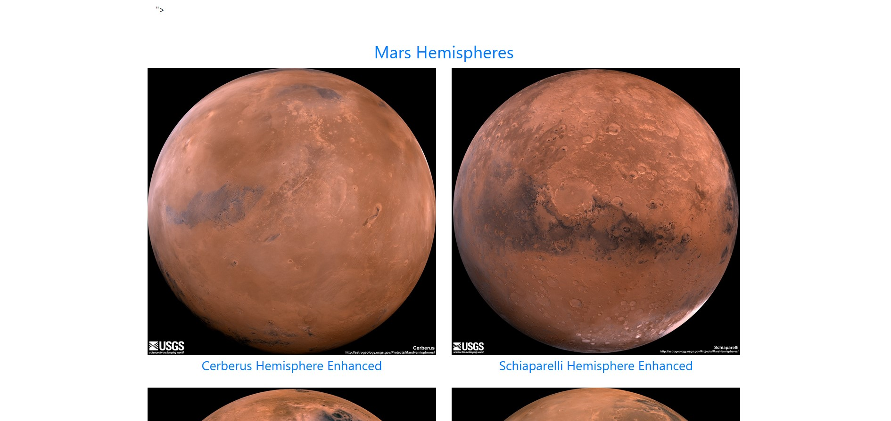
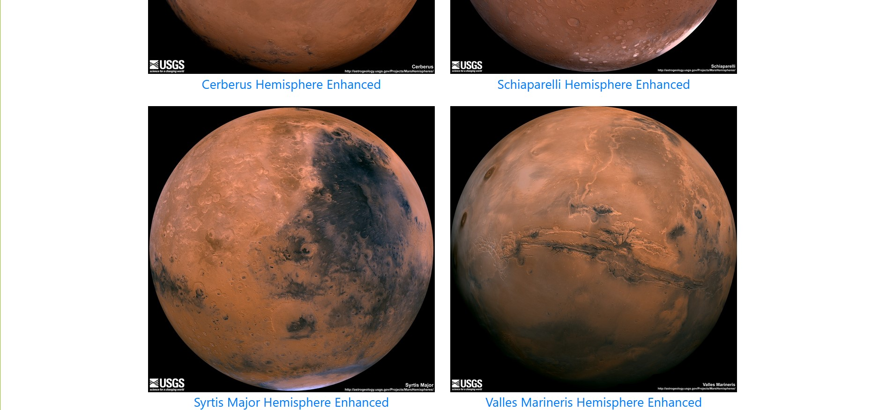

# web-scraping-challenge

# Mission to Mars

In this assignment, I was asked to build a web application that scrapes various websites for data related to the Mission to Mars and displays the information in a single HTML page. The following outlines what I did.

## Step 1 - Scraping

Completed initial scraping using Jupyter Notebook, BeautifulSoup, Pandas, and Requests/Splinter.

* Created a Jupyter Notebook file called `mission_to_mars.ipynb` and used this to complete all of the scraping and analysis tasks. The following outlines what I scraped.

### NASA Mars News

* Scraped the [NASA Mars News Site](https://mars.nasa.gov/news/) and collected the latest News Title and Paragraph Text. Assigned the text to variables.

### JPL Mars Space Images - Featured Image

* Visited the url for JPL Featured Space Image [here](https://www.jpl.nasa.gov/spaceimages/?search=&category=Mars).

* Used splinter to navigate the site and find the image url for the current Featured Mars Image and assigned the url string to a variable called `featured_image_url`.

### Mars Facts

* Visited the Mars Facts webpage [here](https://space-facts.com/mars/) and used Pandas to scrape the table containing facts about the planet including Diameter, Mass, etc.

* Used Pandas to convert the data to a HTML table string.

### Mars Hemispheres

* Visited the USGS Astrogeology site [here](https://astrogeology.usgs.gov/search/results?q=hemisphere+enhanced&k1=target&v1=Mars) to obtain high resolution images for each of Mar's hemispheres.

## Step 2 - MongoDB and Flask Application

Used MongoDB with Flask templating to create a new HTML page that displays all of the information that was scraped from the URLs above.

* Started by converting my Jupyter notebook into a Python script called `scrape_mars.py` with a function called `scrape` that will executed all of my scraping code from above and returned one Python dictionary containing all of the scraped data.

* Next, created a route called `/scrape` that will imported my `scrape_mars.py` script and called my `scrape` function.

  * Stored the return value in Mongo as a Python dictionary.

* Created a root route `/` that queried my Mongo database and passed the mars data into an HTML template to display the data.

* Created a template HTML file called `index.html` that took the mars data dictionary and displayed all of the data in the appropriate HTML elements. The following images are of the final app.

